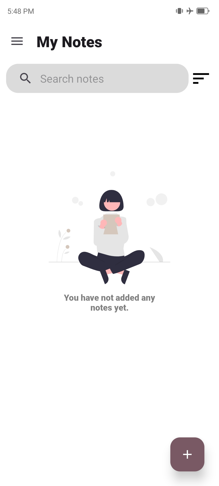
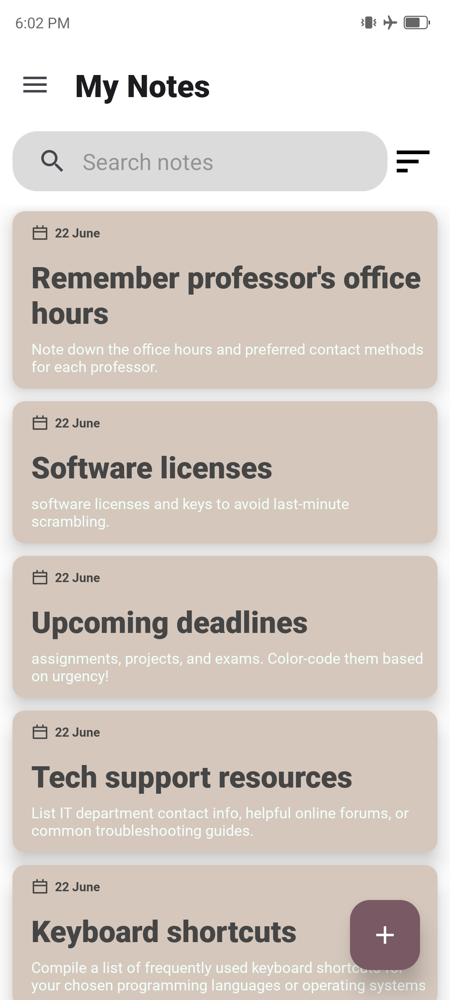
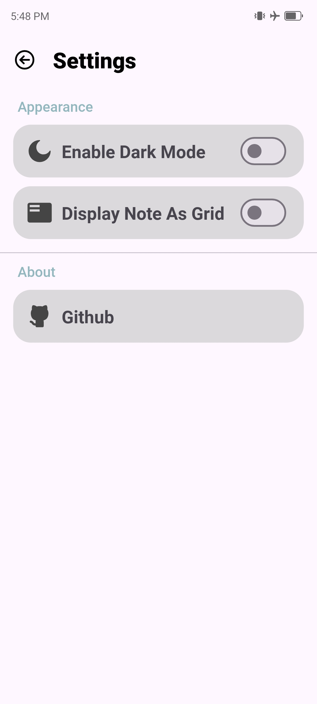

## MindBin

### Background
MindBin is my first take on making a simple android application.

### Features
* Create Notes
* Edit Notes 
* Delete Notes
* Archive Notes
* Dark Mode

## Screenshots
  

