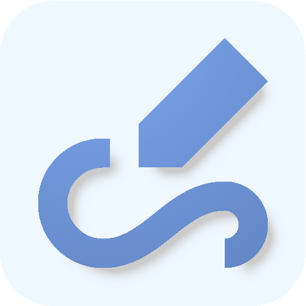

# MindBin

MindBin is an offline note-taking app for Android. Perfect for capturing ideas and organizing projects, MindBin is your go-to solution for note-taking without internet access.

## License

This project is licensed under the GNU General Public License v3.0. See the
[LICENSE](LICENSE) file for details.

A couple of libraries vendored in Aegis' repository are licensed under a different license:
- [prettytime](https://github.com/ocpsoft/prettytime)
